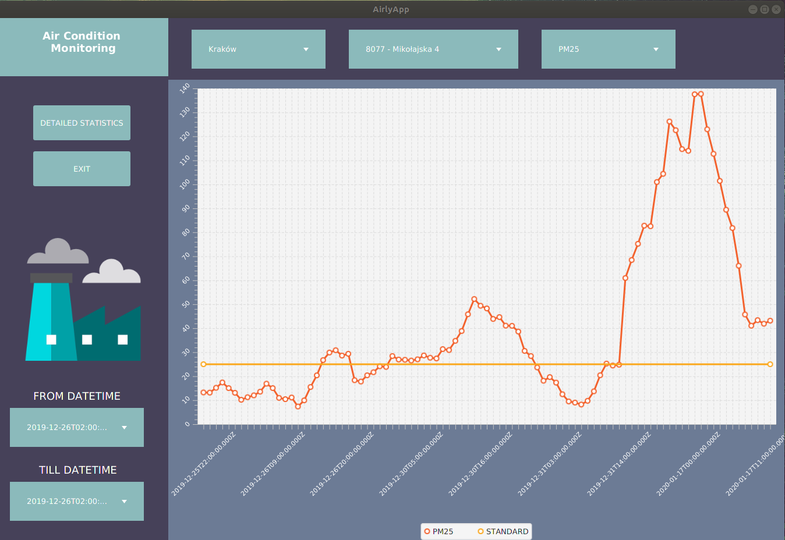
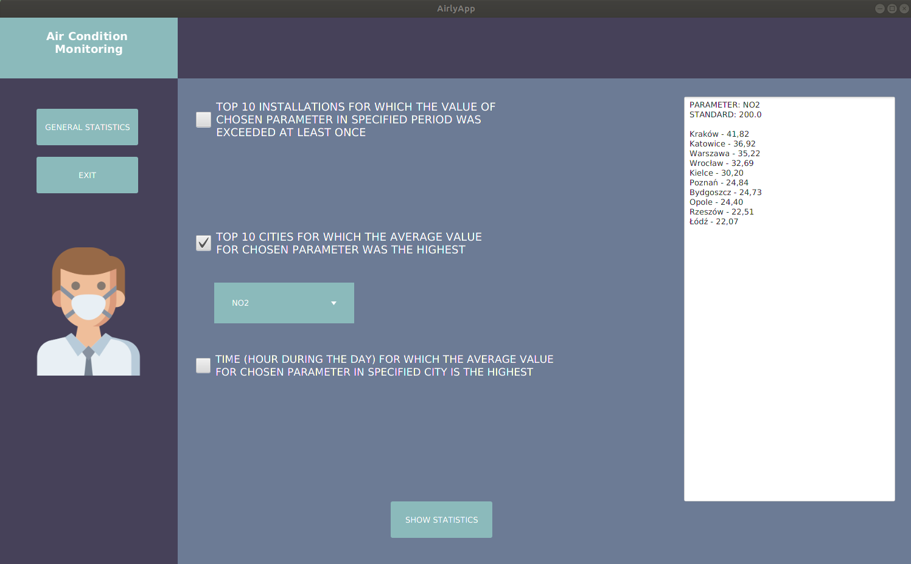

# AirlyApp

AirlyApp is a Java desktop application that processes air quality data received from Airly REST API using Apache Spark and enables to view basic statistics. 
Available views are presented below.

General view

Detailed statistics view

